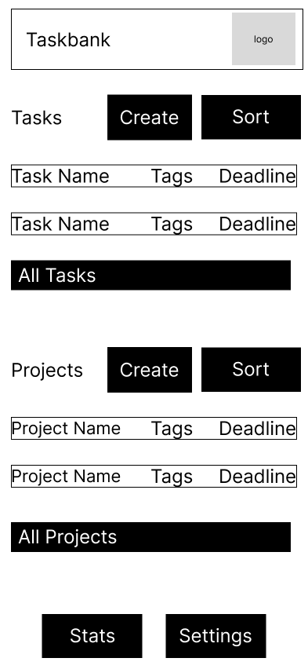
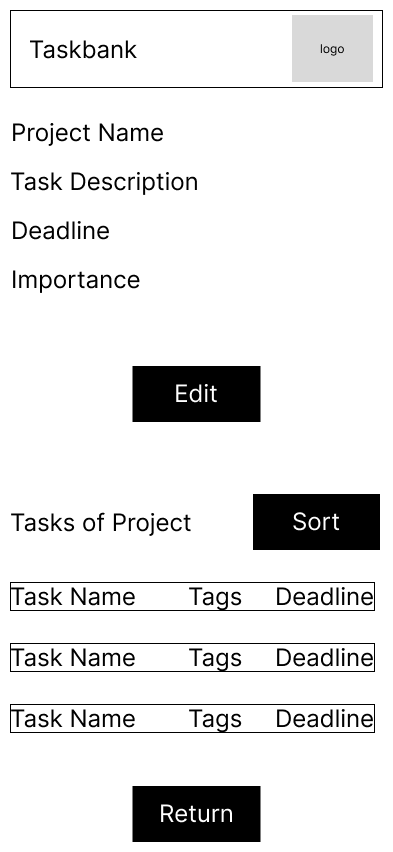
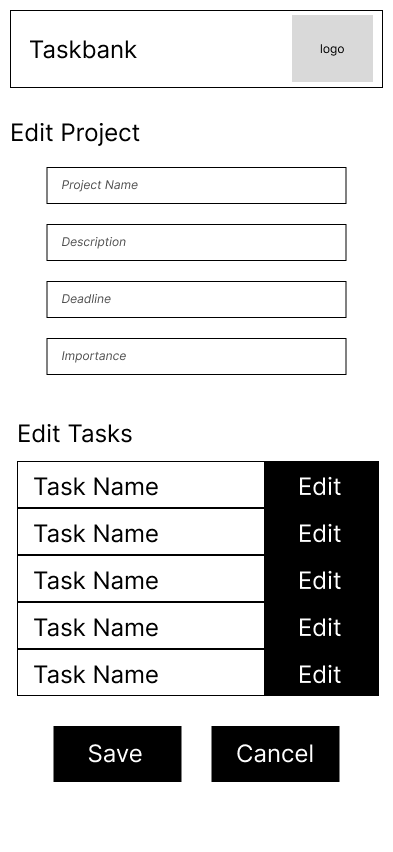
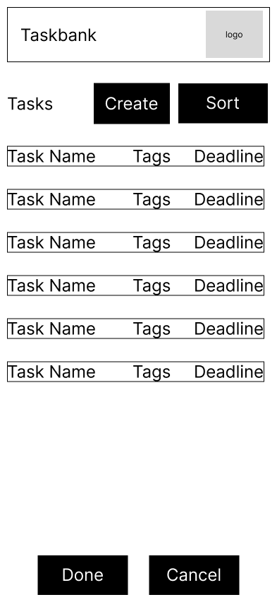
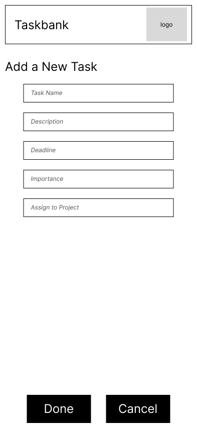
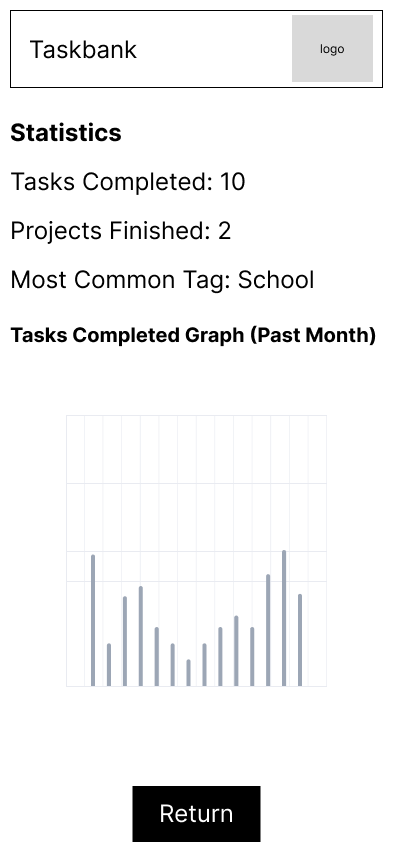

# User Experience Design - Taskbank

## App Map

## Wireframe Diagrams
## Authentication Screens

### Login Screen

The login screen allows existing users to access their account by entering their credentials.

### Registration Screen

New users can create an account through the registration screen.

## Main Navigation

### Home Screen

The main dashboard that serves as the primary landing page after login, providing quick access to all major features.

## Project Management

### All Projects View

Displays a comprehensive list of all user projects with quick access to project details.

### Project View

Detailed view of an individual project, showing associated tasks and project information.

### New Project

Interface for creating a new project with all necessary fields and options.

### Edit Project

Allows users to modify existing project details and settings.

## Task Management

### All Tasks View

Comprehensive list of all tasks across projects, with sorting options.

### Task View

Detailed view of an individual task with all relevant information and actions.

### New Task

Interface for creating a new task with required fields and options.

### Edit Task

Allows users to modify existing task details and properties.

## Additional Features

### Statistics

Dashboard displaying analytics and insights about projects and tasks.

### Settings

User settings and application configuration options.
